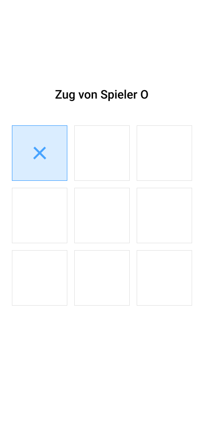
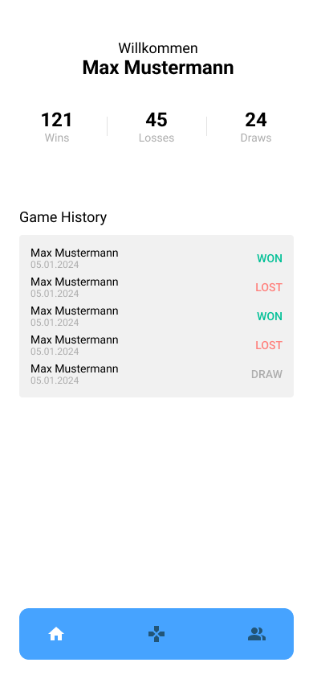

**Case Study: Entwicklung einer Tic-Tac-Toe Web-App mit React**

**Einleitung**

Die mittelständische Firma _InnovApps GmbH_ hat sich in den letzten Jahren als Spezialist für mobile Anwendungen etabliert. Um ihr Portfolio zu erweitern und neue Märkte zu erschließen, plant das Unternehmen den Einstieg in den Web-App-Markt. Als erstes Projekt soll ein klassisches Tic-Tac-Toe-Spiel als Web-Anwendung entwickelt werden.

**Projektauftrag**

Wir, das Entwicklungsteam, wurden mit der Umsetzung dieser Tic-Tac-Toe Web-App beauftragt. Ziel ist es, ein einfaches, aber ansprechendes Spiel zu entwickeln, das sowohl neuen Spielern als auch Nostalgikern Freude bereitet. Das Design-Team hat bereits erste Entwürfe geliefert, aus denen wir die zentralen Use Cases ableiten konnten.

### Design und Use Cases

Das Designteam von MobileX entwickelte bereits umfassende Entwürfe für die Web-App. Aus diesen Designs konnten wir für die erste Version zwei zentrale Use Cases ableiten:

1. **Screen: Game**

   - **Funktionalität:** Hauptspielfenster, in dem zwei Spieler gegeneinander antreten können. Der Bildschirm zeigt das Tic Tac Toe-Raster, aktuelle Spielerinformationen, Spielstatus (z.B. welcher Spieler ist am Zug) und Optionen zum Zurücksetzen des Spiels oder zur Beendigung.

   - **Features:** - Responsive Design für verschiedene Bildschirmgrößen - Interaktives Spielfeld mit visuellen Feedbacks bei Spielzügen - Anzeige von gewonnenen Runden oder Unentschieden
   

    
    
    
   

1. **Screen: Game History**

   - **Funktionalität:** Übersicht über vergangene Spiele, inklusive Details wie Datum, beteiligte Spieler, Ergebnis und Dauer des Spiels.
   - **Features:**
     - Liste der letzten Spiele
     - Möglichkeit, vergangene Spiele erneut anzusehen
     - Statistiken und Auswertungen der Spielerleistung über die Zeit

  

    
   

**Komponenten**

Das Designteam stellt uns folgende Entwürfe bereit:

  

    
    
    
    
    
    
    

   

**Technischer Ansatz**

Für die Umsetzung der Web-App haben wir uns für das JavaScript-Framework **React** entschieden. React ermöglicht uns:

- **Komponentenbasiertes Design**: Wiederverwendbare UI-Komponenten erleichtern Wartung und Erweiterung.
- **State Management**: Effektive Verwaltung des Spielzustands und der Spielhistorie.
- **Performance**: Schnellere Renderzeiten durch virtuellen DOM und effiziente Updates.

**Ergebnisse**

Mit dem Abschluss dieses Projekts wird _InnovApps GmbH_ eine solide Grundlage im Web-App-Markt schaffen. Die Tic-Tac-Toe Web-App dient dabei nicht nur als eigenständiges Produkt, sondern auch als Lernprojekt für zukünftige, komplexere Web-Anwendungen.
